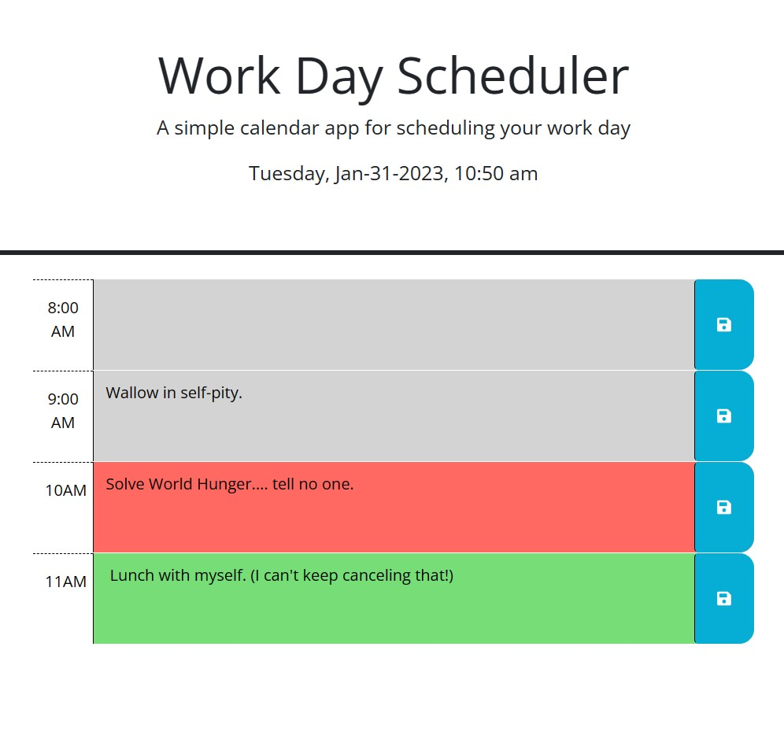

# myCalendar
little  calendar app to help me schedule more effectively

## UserStory
This assignment gave us the opportunity to work with jquery to create a simple scheduler that indicates whether a given timeblock in a standard workday has passed, is present or is coming up. In this app, past timeblocks are greyed out, present ones are displayed in red and future timeblocks are green. 
It also receives user input and saves it in local storage. It will pull the input from local storage the next time the webpage is loaded.

https://willisson7.github.io/myCalendar/